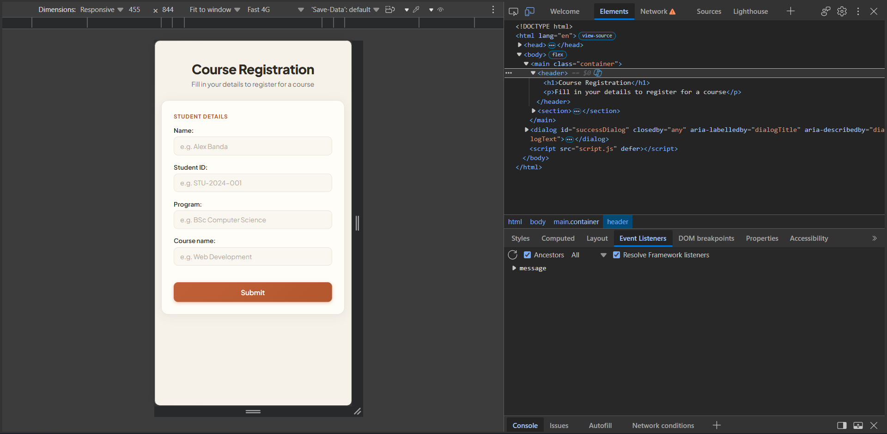
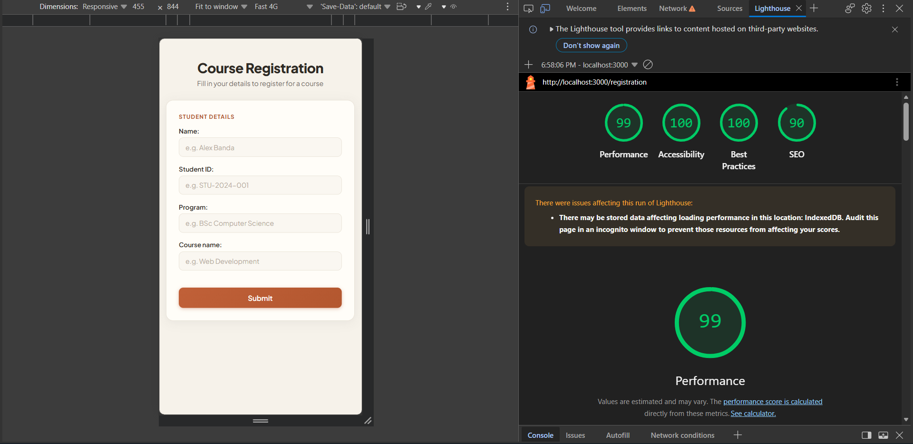
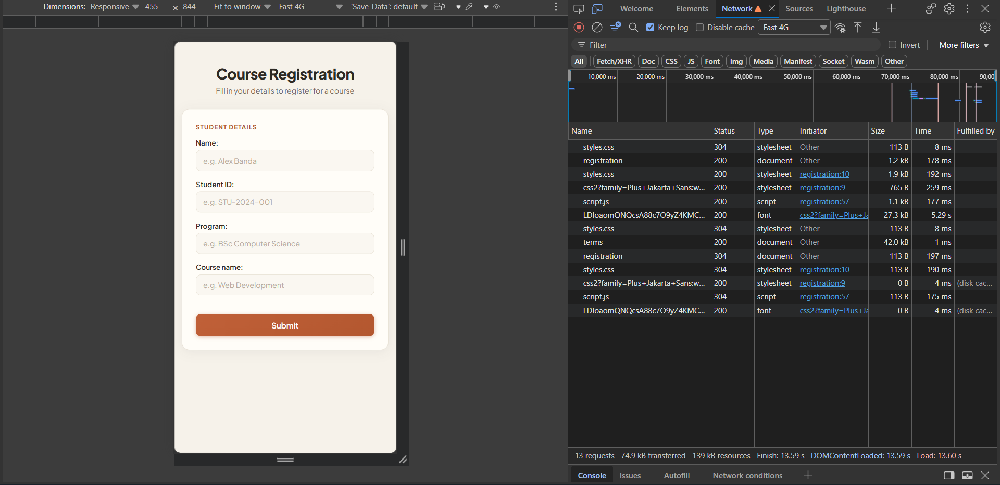

# Course Registration Form

A simple course registration page built with plain HTML, CSS, and TypeScript. Created as a lab exercise in web fundamentals.

## Preview


Submitting the form opens the native `<dialog>` with an animated checkmark:


## DevTools verification

The semantic HTML structure (`main`, `header`, `section`, `fieldset`, `dialog` with ARIA attributes) as seen in the Elements panel:



Lighthouse audit — Performance 99, Accessibility 100, Best Practices 100, SEO 90:



Network panel showing the tiny resource footprint (74.9 kB transferred):



## Features

- Semantic HTML structure (`form`, `fieldset`/`legend`, `label`, native `<dialog>`)
- Native form validation — the browser blocks empty submissions and shows its own error messages, no JavaScript needed
- TypeScript handled in one place: reacting to valid submissions and showing the success dialog
- Accessible dialog (`aria-labelledby`, `aria-describedby`), visible keyboard focus (`:focus-visible`), and support for `prefers-reduced-motion`
- Design tokens in CSS (`:root` custom properties) for the warm off-white + terracotta + sage palette
- Responsive layout, works down to small viewports

## Files

| File | Purpose |
|---|---|
| `registration.html` | Page structure and form |
| `styles.css` | All styling, design tokens, animations |
| `script.ts` | TypeScript source — edit this one |
| `script.js` | Compiled output of `script.ts` — do not edit by hand |

## Running it

Open `registration.html` directly in a browser, or serve the folder:

```
npx serve .
```

The Plus Jakarta Sans font loads from Google Fonts, so an internet connection is needed for the exact typeface (the page falls back to system fonts offline).

## Editing the TypeScript

`script.ts` is the source of truth. After changing it, recompile:

```
tsc script.ts --target es2020 --strict
```

Or let the compiler watch for changes:

```
tsc script.ts --target es2020 --strict --watch
```

## Key concept

The `submit` event only fires **after** native HTML validation passes. That is why the handler is small: `e.preventDefault()` stops the page reload, and everything in the handler operates on already-valid data.
