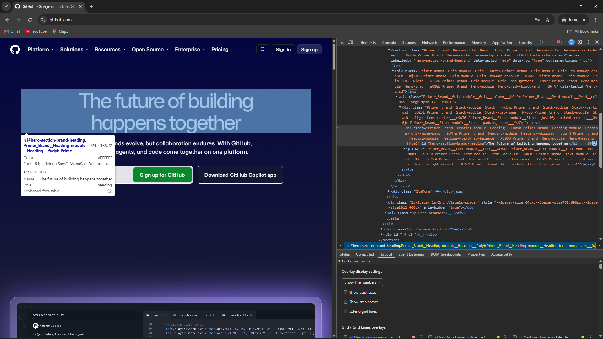
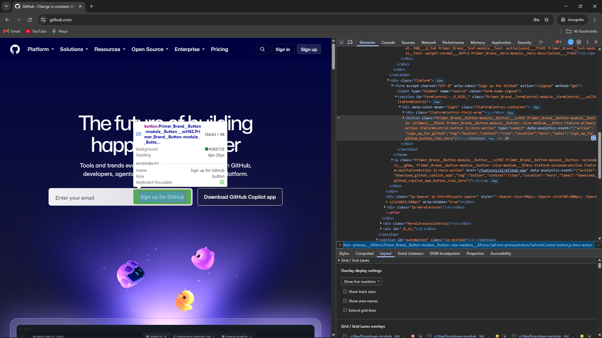
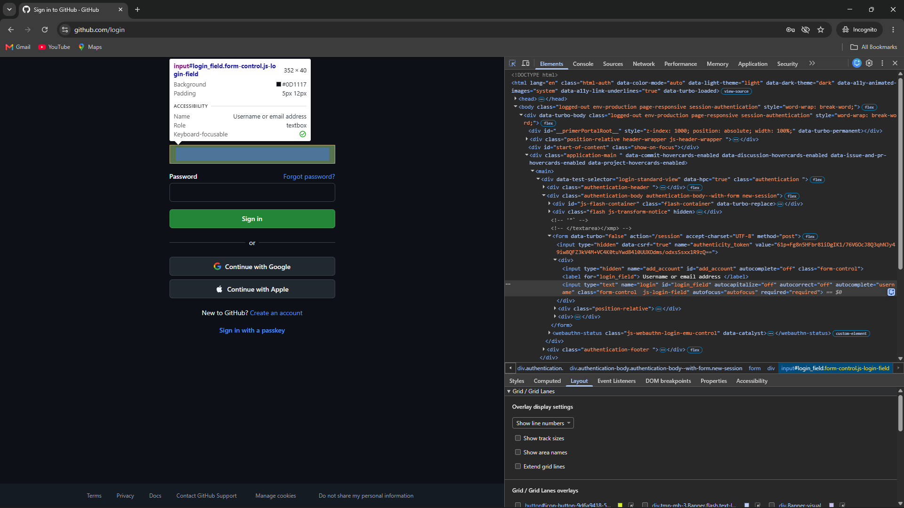
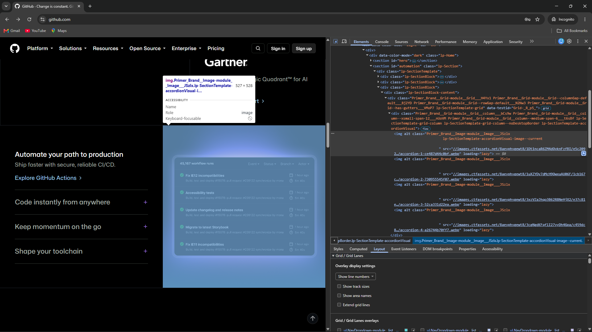
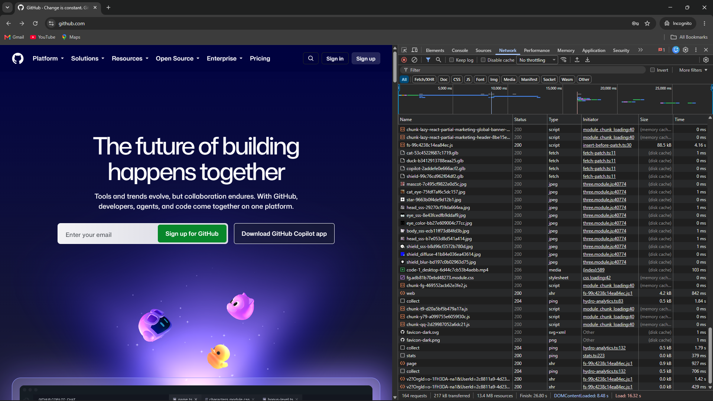

# LAB 2 — Inspect a live page in 5 minutes

DevTools inspection practical. No code is written for this lab; the deliverable is the screenshot evidence below and a one-paragraph diagnosis.

## Objective

Open a page you use often and use the browser DevTools to inspect it:

1. Inspect a heading, a button and a form field.
2. Check whether images have alternative text.
3. Open the Network panel and reload the page.
4. Find the slowest request and explain what it is.

## Page inspected

| | |
|---|---|
| URL | <https://github.com/> (heading, button, images, network) |
| URL | <https://github.com/login> (form field) |
| Browser | Google Chrome — DevTools, Elements and Network panels |
| Date | 16 Sep 2026 |

## Method

Opened GitHub in Chrome, used the Elements panel's element picker to select a heading, a button, a form field and an image, and read each element's Accessibility info (name and role). Opened the Network panel and reloaded the page, then read the request table to find the slowest request.

## Findings

### Heading

| Property | Value |
|---|---|
| Tag | `h1` |
| `id` | `hero-section-brand-heading` |
| Text | "The future of building happens together" |
| Accessible name | "The future of building happens together" |
| Role | `heading` |

A single `h1` carrying the hero's main message, so the page has one clear top-level heading.

### Button

| Property | Value |
|---|---|
| Tag | `button` |
| Accessible name | "Sign up for GitHub" |
| Role | `button` |
| Type | `submit` |
| Form | `action="/signup"`, `method="get"`, `aria-label="Sign up for GitHub"` |

The button has a visible text label, so it is announced correctly without needing its own `aria-label`.

### Form field

| Property | Value |
|---|---|
| Page | <https://github.com/login> |
| Tag | `input#login_field.form-control.js-login-field` |
| Type | `text` |
| `name` | `login` |
| Label | "Username or email address" (`label[for="login_field"]`) |
| Accessible name / role | "Username or email address" / `textbox` |
| Other attributes | `required`, `autocomplete="username"`, `autofocus` |
| Form | `action="/session"`, `method="post"` |

The field is programmatically labelled, marked `required`, and hints `autocomplete="username"` so password managers and autofill can populate it.

### Image alternative text

The homepage has 24 `` elements and every one carries an `alt` attribute. Representative sample:

| Image | `alt` | Verdict |
|---|---|---|
| `particles-*.png` (background) | `""` (empty) | Correct — purely decorative. |
| `logo-duolingo.svg` | `"Duolingo"` | Correct — logo link needs a name. |
| `logo-gartner.svg` | `"Gartner"` | Correct. |
| `hero-*.webp` (product shot) | "Copilot Autofix identifies vulnerable code and provides an explanation…" | Correct — long, descriptive alt for a meaningful image. |
| `pillar-1/2/3-*.webp` | Descriptive sentences about each feature | Correct. |
| `accordion-1..4.webp` | `""` (empty) | Correct — decorative illustrations beside visible text. |
| Partner logos (`figma.svg`, `mercedes-benz.svg`, `mercado-libre.svg`) | `""` (empty) | Borderline — fine only if the surrounding text already conveys them. |

The screenshot below shows the `accordion-1-*.webp` image selected: its `alt=""` is empty and its accessible name is blank, which is the right call for a decorative image (it also uses `loading="lazy"`).

Overall: alt handling is strong. Decorative images are correctly hidden, logos and content images are named, and no image is missing the attribute.

### Network — slowest request

Reload result (Network panel): **164 requests**, 217 kB transferred, 13.4 MB resources, DOMContentLoaded 8.48 s, Load 16.32 s.

| Metric | Slowest request |
|---|---|
| Resource | `fs-99c4238c14ea84ec.js` |
| Type | `script` (JavaScript module chunk) |
| Size | 88.5 kB |
| Time | 4.16 s |
| Initiator | module chunk loading |

The slowest request in the capture is a **JavaScript module chunk** (`fs-99c4238c14ea84ec.js`, ~88.5 kB, 4.16 s). It is a lazily-loaded script bundle pulled in by GitHub's module loader, and it is the longest download in the table — the next slowest requests (`web` at 1.84 s, a `collect` beacon at 1.79 s) are less than half its time. Notably the large media assets on the page — the `code-1_desktop-*.mp4` video and the `.glb` 3D models — report near-zero times because they were served from the browser's disk cache on this reload, so they did not compete with the script for network time.

## Diagnosis

GitHub's pages are well engineered for accessibility: the homepage uses a single semantic `h1` with a clear accessible name, the "Sign up for GitHub" button has a real text label, the login form field is properly labelled, `required`, and hints `autocomplete="username"`, and every image has an `alt` attribute — decorative images are correctly hidden with `alt=""` while logos and product screenshots are described. The performance picture is dominated by JavaScript rather than media: on a reload the slowest request is the ~88.5 kB `fs-*.js` module chunk at 4.16 s, while the large video and 3D assets load from cache and cost almost nothing. The takeaway is that GitHub's accessibility is solid by default, and its remaining load-time cost comes from many small, lazily-loaded script chunks rather than from images or video.

## Files

| File | Purpose |
|---|---|
| `README.md` | This report — findings and diagnosis |
| `assets/elements-heading.png` | Elements panel: the `h1` heading |
| `assets/elements-button.png` | Elements panel: the "Sign up for GitHub" button |
| `assets/elements-form-field.png` | Elements panel: the login form field |
| `assets/elements-image-alt.png` | Elements panel: an image's `alt` attribute |
| `assets/network-panel.png` | Network panel after reload |
