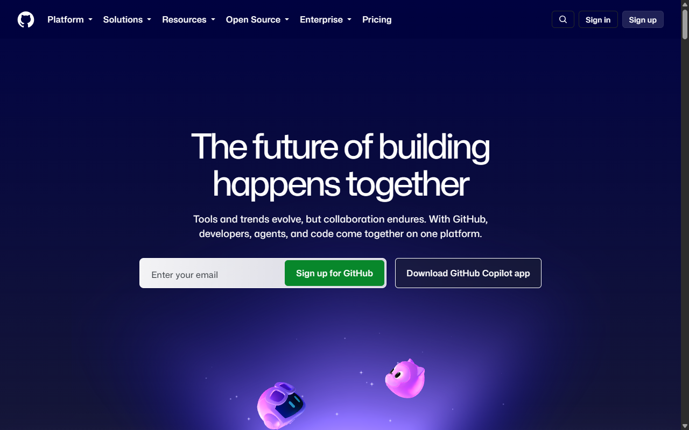

# LAB 2 — Inspect a live page in 5 minutes

DevTools inspection practical. No code is written for this lab; the deliverable is the evidence below and a one-paragraph diagnosis.

## Objective

Open a page you use often and use the browser DevTools to inspect it:

1. Inspect a heading, a button and a form field.
2. Check whether images have alternative text.
3. Open the Network panel and reload the page.
4. Find the slowest request and explain what it is.

## Page inspected

| | |
|---|---|
| URL | <https://github.com/> |
| Title | GitHub · Change is constant. GitHub keeps you ahead. |
| Browser | Chromium (Playwright), viewport 1280 × 800 |
| Date | 15 Sep 2026 |

## Method

Opened the live GitHub home page, inspected the DOM for a heading, button and form field, read every `` element's `alt` attribute, then reloaded the page and read the resource timings to find the slowest request.

## Findings

### Heading

| Property | Value |
|---|---|
| Tag | `h1` |
| Text | "The future of building happens together" |
| Notes | A single `h1` per page, matching the hero's main message. Carries Primer brand heading classes. |

### Button

| Property | Value |
|---|---|
| Tag | `button` |
| Accessible name | "Sign up for GitHub" |
| Type | `submit` |
| Notes | Has a visible text label, so no `aria-label` is needed. A separate `Sign in` link (`a href="/login"`) sits in the header. |

### Form field

| Property | Value |
|---|---|
| Tag | `input` |
| Type | `email` |
| `id` / `name` | `hero_user_email` / `user_email` |
| Placeholder | `you@domain.com` |
| `autocomplete` | `email` |
| Label | "Enter your email" (`label[for="hero_user_email"]`) |
| Form | `action="/signup"`, `method="get"` |

The field is programmatically labelled, uses a semantic `type="email"` (so the browser validates it) and hints `autocomplete="email"` for autofill.

### Image alternative text

24 `` elements on the page. Every one has an `alt` attribute. Representative sample:

| Image | `alt` | Verdict |
|---|---|---|
| `particles-*.png` (background) | `""` (empty) | Correct — purely decorative. |
| `logo-duolingo.svg` | `"Duolingo"` | Correct — logo link needs a name. |
| `logo-gartner.svg` | `"Gartner"` | Correct. |
| `hero-*.webp` (product shot) | "Copilot Autofix identifies vulnerable code and provides an explanation…" | Correct — long, descriptive alt for a meaningful image. |
| `pillar-1/2/3-*.webp` | Descriptive sentences about each feature | Correct. |
| `accordion-1..4.webp` | `""` (empty) | Acceptable — decorative illustrations beside visible text. |
| Partner logos (`figma.svg`, `mercedes-benz.svg`, `mercado-libre.svg`) | `""` (empty) | Borderline — if these logos carry meaning they should be named; empty `alt` is fine only if the surrounding text already conveys them. |

Overall: alt handling is strong. Decorative images are correctly hidden, logos and content images are named, and no image is missing the attribute.

### Network — slowest request

Reload result: 159 requests, TTFB ≈ 673 ms, DOMContentLoaded ≈ 3.9 s, load ≈ 3.9 s, HTML ≈ 118 KB.

| Metric | Slowest request |
|---|---|
| Resource | `code-1_desktop-6d44c7cb53b4aebb.mp4` |
| Type | `video` |
| Size | 218,922 bytes (~219 KB) |
| Time | ≈ 3.29 s |
| Started at | ≈ 4.0 s after navigation |

The slowest request is the hero **product demo video** (`code-1_desktop-*.mp4`, ~219 KB). It is the single largest payload downloaded on reload and finishes last, so it dominates the end of the load timeline. On a cold (uncached) first load the largest request instead is the `landing-pages-*.js` bundle (~508 KB), showing that GitHub ships a large amount of JavaScript alongside the media.

## Diagnosis

GitHub's home page is well engineered for accessibility: it uses one semantic `h1`, a properly labelled email `input` with `type="email"` and `autocomplete`, a `button` with a real text label, and it gives every image an `alt` attribute — decorative images are correctly hidden with `alt=""` while logos and product screenshots are described. The performance story is the more interesting one: after a reload the slowest request is the ~219 KB hero demo **video**, which lands last and extends the load event, and on a cold load the heaviest item is a ~508 KB JavaScript bundle. In short, the page is accessible by default but media- and JavaScript-heavy, so the biggest wins would come from lazy-loading or trimming the hero video and splitting the JS bundle.

## Evidence

GitHub home page as inspected (hero heading, email field, and "Sign up for GitHub" button visible):

## Files

| File | Purpose |
|---|---|
| `README.md` | This report — findings and diagnosis |
| `assets/github-home.png` | Screenshot of the inspected page |
