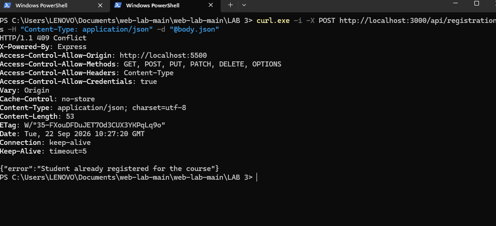
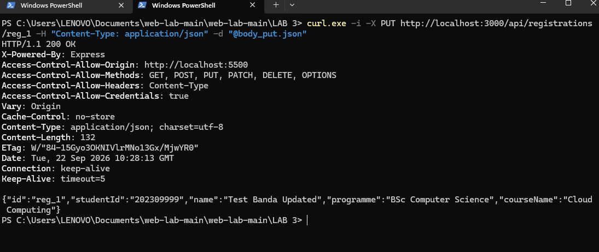
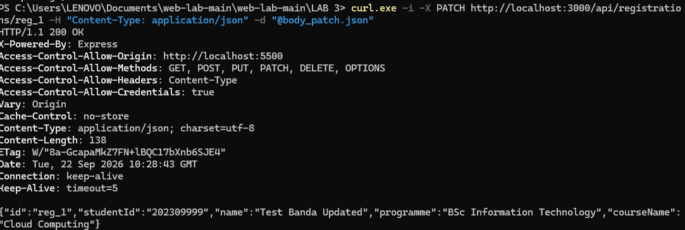
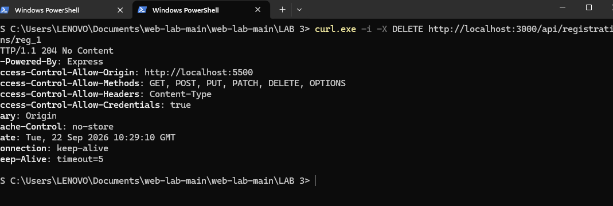
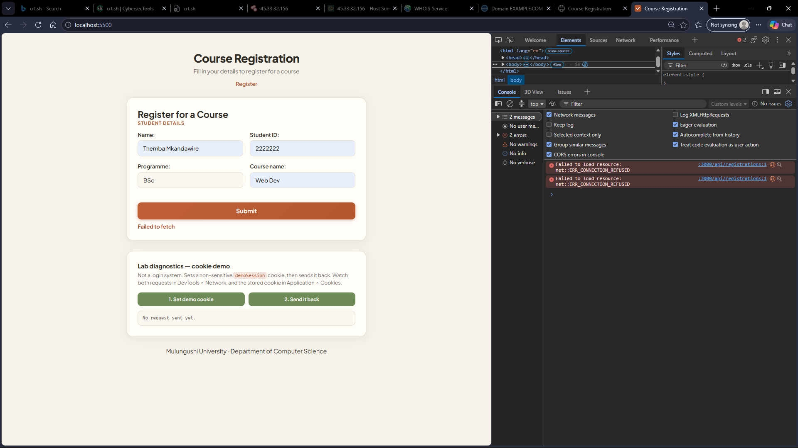
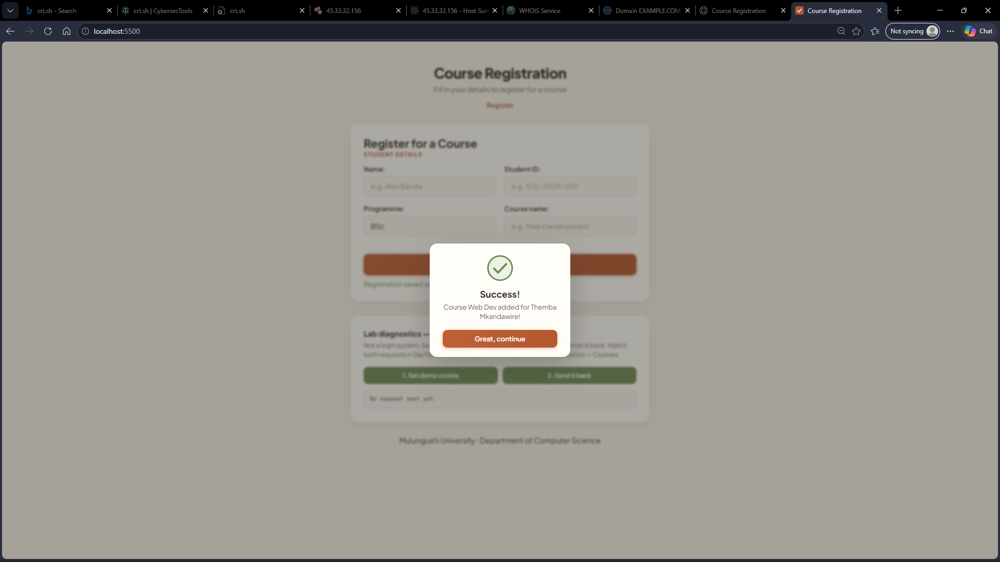

# ICT461 Lab 3— Course Registration Portal

Mulungushi University · School of Engineering and Technology · Department of
Computer Science and IT — **ICT461 Web standards and HTTP fundamentals**

A small course registration portal: an accessible, responsive registration form
that talks to a JSON API over Fetch. Built as a pair lab to demonstrate browser ↔
server communication, HTTP methods and status codes, validation on both sides,
caching headers, cookies and CORS.

## Architecture

```
browser (form UI)          web server (static files)      application + data store
http://localhost:5500  →   serve-ui.js  →  index.html  →  app.js + api.js (Fetch)
                                    |
                                    | fetch() JSON, cross-origin
                                    v
                          Express API  http://localhost:3000
                          server.js — in-memory records (a JS array)
```

There is **no database** — the lab specifies in-memory records. Consequence we
observed ourselves: every restart wipes all registrations (documented in
`AI-use.md` Entry 5).

## Running it

Requirements: Node.js 18.11+ (for `node --watch`) and Git.

Two terminals, one process each:

```powershell
npm install

# terminal 1 — the API on port 3000
npm start

# terminal 2 — the interface on port 5500
npm run ui
```

Or start both in one window with the helper script:

```powershell
.\start.ps1     # Windows PowerShell
# blocked by the execution policy? run:
powershell -ExecutionPolicy Bypass -File .\start.ps1
```

Ctrl+C stops both. The script runs the same two `node` commands directly, without
`--watch`; keep `npm start` + `npm run ui` when you want the API to restart on
save. If a port is already busy it stops with a message instead of starting half
the stack; `.\start.ps1 -Force` replaces whatever is on ports 3000/5500.

Then open **http://localhost:5500**. Submitting the form sends a `POST` to the
API; success opens a dialog, server-side errors (400/409) are shown as visible
text under the button.

The API prints its CORS state on startup, so you always know which mode you are in:

```
API running on http://localhost:3000
CORS: allowing http://localhost:5500 (credentials included)
```

Two environment variables make the Task 3.2 experiments repeatable without editing
code. They only affect the process you set them in:

```powershell
$env:CORS = "off"                                  # capture the blocked-request failure
$env:UI_ORIGIN = "http://example.com"              # capture a wrong-origin failure
Remove-Item Env:CORS, Env:UI_ORIGIN -ErrorAction SilentlyContinue   # back to normal
```

### Programme preference (Task 1.3)

`app.js` stores **only** the programme field in `localStorage` under the key
`preferredProgramme`, after the server confirms the registration, and reads it
back on load. A reload therefore pre-fills Programme and leaves Name, Student ID
and Course empty — the "only a programme preference" requirement, visible in the
UI. `sessionStorage` differs in lifetime and scope: it is cleared when the tab
closes and is per-tab, where `localStorage` survives the tab and is shared across
tabs of the same origin.

## The API contract

Every route lists the request body, the success code and two plausible failures.
**Implemented** means the running code returns it; **design-only** means we can
name the failure but deliberately did not build it for this prototype (per the lab
instruction to label rather than implement).

| Method and route | Request body | Success | Failure 1 | Failure 2 |
|---|---|---|---|---|
| `GET /api/courses` | none | 200 + course list | 401 unauthenticated — *design-only* | 500 data store unavailable — *design-only* |
| `GET /api/registrations/:id` | none | 200 + one record | 404 unknown id — **implemented** | 410 record already deleted — *design-only* |
| `POST /api/registrations` | `{name, studentId, programme, courseName}` | 201 + `Location` + record | 400 missing/empty field — **implemented** | 409 repeated studentId + course — **implemented** |
| `PUT /api/registrations/:id` | full record (all four fields) | 200 full replace | 404 unknown id — **implemented** | 400 any required field missing — **implemented** |
| `PATCH /api/registrations/:id` | `{programme}` | 200 programme changed, rest untouched | 404 unknown id — **implemented** | 400 empty/missing programme — **implemented** |
| `DELETE /api/registrations/:id` | none | 204, no body | 404 unknown id — **implemented** | 403 not the record owner — *design-only* |
| `GET /api/demo/session` | none | 200 + cookie echo | 404 route disabled in production — *design-only* | 500 — *design-only* |
| `POST /api/demo/session` | none | 200 + `Set-Cookie` | 403 cookies disabled — *design-only* | 500 — *design-only* |
| `ALL /inspect` | any (JSON, form data or text) | 200 + echo of method, URL parts, headers, body | 413 body too large — *design-only* | 415 unsupported body type — *design-only* |

Two different 400s exist on POST/PUT and they are not the same thing: a
*malformed* JSON body is rejected by Express's body parser with its own HTML 400,
while valid JSON with invalid data is rejected by our handler with our JSON error.
See decision 2 below.

### Response headers that matter (Task 3.1)

| Route | `Cache-Control` | `ETag` |
|---|---|---|
| `GET /api/courses` | `public, max-age=60` | SHA-1 of the JSON, so it changes only when the data changes |
| `/api/registrations*` and `/api/demo*` | `no-store` | Express's default weak ETag |

`public, max-age=60` means the response is *fresh* for 60 seconds — a repeat
request inside that window may be served from cache with no network call at all.
*Revalidation* is the other mechanism: after freshness expires, or when the client
sends `If-None-Match`, the server compares tags and answers **304 Not Modified
with no body**, so the client reuses what it already has. Freshness avoids the
request; revalidation avoids the *body*.

`no-store` is applied to everything under `/api/registrations` and `/api/demo`
because those responses contain per-student data and set state — caching them
would risk one student seeing another's record.

### Idempotency (observed, not claimed)

- **POST is not idempotent:** two identical POSTs returned `201 Created` then
  `409 Conflict` — same request, different intended effect on the server.
- **PUT is idempotent:** the same PUT twice returned `200` both times with an
  *identical ETag* — the second replacement changed nothing.
- **DELETE is idempotent in effect but not in status:** `204` then `404`.

Idempotency is about the *intended server effect*, not about matching status
codes: DELETE removed the record once and a repeat removes nothing, so the end
state is the same even though `204` became `404`. PUT ends in the same state it
already had, so it is idempotent even though the ETag proves nothing changed.

### Design-only behaviour (labelled, per the lab instruction)

- PUT does **not** guard against creating a duplicate combination — the 409
  duplicate rule exists only on POST.
- PATCH is lenient: extra fields in the body are ignored, only `programme` is
  applied.
- Record IDs use `"reg_" + (registration.length + 1)`, which is unsafe after
  deletions — we observed an ID collision in testing (Entry 6). A monotonic
  counter would fix it; out of scope for the prototype.
- Validation checks *presence*, not quality — the server accepted
  `"Test BandaUpdated"` verbatim. A programme whitelist would be stricter.
- `GET /api/courses` has no auth, so its 401/500 failures stay design-only.

## Decisions worth defending (short decision note)

1. **Server-side validation is mandatory even though the form has `required`.**
   The client can be bypassed; cURL sent a missing-`studentId` payload that no
   browser form would have produced, and the server rejected it with 400.
2. **There are two different 400s.** Express's body parser rejects malformed
   JSON with an HTML 400; our handler rejects valid JSON with invalid data using
   our own JSON error. Same status, different layer — useful distinction we
   discovered from real stack traces.
3. **Vocabulary:** the form sends `programme` / `courseName` to match the
   server field names exactly. One vocabulary across the boundary, chosen late —
   which is why it is logged in `AI-use.md` Entry 4.
4. **CORS:** the middleware allows exactly `http://localhost:5500` with explicit
   methods and `Content-Type`, plus a 204 answer to `OPTIONS` preflight — not a
   wildcard. The origin is read from `UI_ORIGIN` so the failure case can be
   reproduced by restarting with `CORS=off` instead of editing and reverting code.
5. **204 must carry no body** — `res.status(204).end()` server-side, and the
   client helper skips `res.json()` for status 204.
6. **DELETE uses `findIndex` + `splice`,** the GET/PUT/PATCH use `find` — removal
   needs the position, not the object.
7. **The ETag is computed from the data, not from a timestamp.** SHA-1 over
   `JSON.stringify(course)` means an unchanged list keeps the same tag (so the
   304 experiment is honest) and any edit produces a new one (so the 200-with-new-
   data experiment is honest). A time-based or random tag would pass a naive test
   while proving nothing.
8. **The preflight is answered even when CORS is disabled.** With `CORS=off` the
   browser still sends `OPTIONS`; what it refuses to do is *use* a reply with no
   `Access-Control-Allow-Origin`. Answering keeps the request visible in the
   Network panel, which is the evidence Task 3.2 asks for.
9. **Cookies are demonstrated, not used for auth.** The demo route sets a
   non-sensitive value with `HttpOnly`, `SameSite=Lax` and `Path=/`, and the
   client sends `credentials: "include"`. Because credentials are allowed, the
   origin must be exact — `Access-Control-Allow-Origin: *` is illegal with
   `Access-Control-Allow-Credentials: true`, which is the real reason we never
   used a wildcard.
10. **The diagnostics panel is separate from the form.** The cookie demo sits in
    its own labelled section so the registration flow stays a clean Task 1
    deliverable, and the Task 4.1 evidence is two clicks away.

## Manual API tests (fixtures committed)

```powershell
# PowerShell note: use curl.exe (not curl — it aliases Invoke-WebRequest),
# and prefer -d "@file" payloads: PowerShell 5.1 mangles inline JSON with spaces
npm start                       # then, in a second terminal:
curl.exe -i http://localhost:3000/api/courses
curl.exe -i http://localhost:3000/api/registrations/reg_1
curl.exe -i -X POST http://localhost:3000/api/registrations -H "Content-Type: application/json" -d "@body.json"
curl.exe -i -X PUT http://localhost:3000/api/registrations/reg_1 -H "Content-Type: application/json" -d "@body_put.json"
curl.exe -i -X PATCH http://localhost:3000/api/registrations/reg_1 -H "Content-Type: application/json" -d "@body_patch.json"
curl.exe -i -X DELETE http://localhost:3000/api/registrations/reg_1
```

The JSON payload files (`body.json`, `body_put.json`, `body_patch.json`,
`body_patch_empty.json`, `body_bad.json`) are committed as repeatable test
fixtures.

### The committed test fixtures

Every payload below is a real file in the repository, so the tests are repeatable
and a marker can run them without retyping JSON. PowerShell 5.1 splits inline JSON
at spaces and eats quotes — we hit both, see `AI-use.md` Entry 4 — which is why
these live in files and are sent with `-d "@file"`.

| File | Contents | Used for | Expected result |
|---|---|---|---|
| `body.json` | `{"name":"Test Banda","studentId":"202309999","programme":"BSc Computer Science","courseName":"Cloud Computing"}` | `POST /api/registrations` | `201` + `Location` + the new record |
| `body.json` sent again | the same file, unmodified | repeated `POST` — the idempotency question | `409` + `{"error":"Student already registered for the course"}` |
| `body_bad.json` | `{"name":"No StudentId","programme":"BSc Computer Science","courseName":"Cloud Computing"}` | `POST` with `studentId` missing | `400` + `{"error":"invalid data"}` |
| `body_put.json` | `{"name":"Test Banda Updated","studentId":"202309999","programme":"BSc Computer Science","courseName":"Cloud Computing"}` | `PUT /api/registrations/:id` | `200`, full replace; running it twice gives an identical ETag |
| `body_patch.json` | `{"programme":"BSc Information Technology"}` | `PATCH /api/registrations/:id` | `200`, only `programme` changes, the other three fields untouched |
| `body_patch_empty.json` | `{"programme":""}` | `PATCH` with an empty value | `400` + `{"error":"programme is required and cannot be empty"}` |

Two things these fixtures deliberately demonstrate:

- **`body_bad.json` is valid JSON carrying invalid data**, so it reaches our handler
  and gets *our* JSON 400. It is not the malformed-JSON case: that one is rejected
  earlier by Express's body parser with an HTML 400 (decision 2 above). To see the
  second 400, send a body with unquoted keys such as `{name:Test Banda}`.
- **`body_put.json` must contain all four fields.** PUT is a full replace, so a
  partial body is a `400` rather than a partial update — partial updates are what
  `PATCH` is for.

Captures of the four committed-payload runs, all with `curl.exe -i`:

| Run | Expected | Captured |
|---|---|---|
| `POST` with `body.json`, sent twice | `201`, then `409` | `assets/api-post-409-conflict.png` — `409` + `{"error":"Student already registered for the course"}` |
| `PUT` with `body_put.json` | `200`, full replace | `assets/api-put-200.png` — `200`, all four fields replaced |
| `PATCH` with `body_patch.json` | `200`, only `programme` changes | `assets/api-patch-200.png` — `200`, only `programme` is `BSc Information Technology` |
| `DELETE` | `204`, no body | `assets/api-delete-204.png` — `204 No Content`, nothing after the headers |









## Task 2.3 — the `/inspect` diagnostic route

`/inspect` echoes what the server actually received, so `Accept` and
`Content-Type` can be compared instead of guessed. It accepts JSON, form data and
plain text, each through its own body parser (`express.json()`,
`express.urlencoded()`, `express.text()`).

```powershell
# JSON body
curl.exe -s -X POST http://localhost:3000/inspect `
  -H "Content-Type: application/json" -H "Accept: application/json" -d "@body.json"

# form data body, with a query string and a fragment
curl.exe -s -X POST "http://localhost:3000/inspect?course=ICT461#section" `
  -H "Content-Type: application/x-www-form-urlencoded" -H "Accept: text/html" `
  -d "name=Test+Banda&programme=BSc+CS"
```

What to look for in the reply:

- `accept` and `contentType` are **different headers with different jobs**.
  `Content-Type` describes the body the client *sent*; `Accept` describes what the
  client *will accept back*. The second command sends form data but still accepts
  `text/html`, which is legal and normal.
- `urlParts` labels the scheme (`http`), host (`localhost`), port (`3000`), path
  (`/inspect`) and the parsed query object.
- `fragment` is `(absent — a browser never sends the #fragment)`. The `#section`
  in the command above never reaches the server; the fragment is stripped by the
  client before the request is made. That is the proof the lab asks for.

### Evidence to capture (Task 2.3)

| Check | Command | Observed |
|---|---|---|
| JSON body echoed | first command | `assets/inspect-json.png` — the body comes back verbatim under `body` |
| Form-data body echoed | second command | `assets/inspect-formdata.png` — `name=Test Banda`, `programme=BSc CS` |
| `Accept` vs `Content-Type` differ | second command | `assets/inspect-formdata.png` — `accept: text/html`, `contentType: application/x-www-form-urlencoded` |
| `#fragment` absent from the server's view | second command | `assets/inspect-formdata.png` — `"fragment": "(absent — a browser never sends the #fragment)"` |


## Task 3.1 — caching: ETag, 304 and freshness

```powershell
# 1. read the ETag the server computes
curl.exe -i -s http://localhost:3000/api/courses

# 2. send it back — expect 304 Not Modified and NO body
#    NOTE: PowerShell strips embedded double quotes when passing arguments to a
#    native exe. Keep the tag in a variable, or use the --% stop-parsing operator,
#    otherwise the server receives an unquoted tag and correctly answers 200.
$etag = (curl.exe -s -D - -o NUL http://localhost:3000/api/courses |
         Select-String -Pattern '^ETag: ').ToString().Substring(6).Trim()
$header = "If-None-Match: `"$etag`""
curl.exe -i -s http://localhost:3000/api/courses -H $header

# 3. change the course data in server.js, restart, repeat step 1 —
#    the ETag changes and step 2 now answers 200 with the new list
```

### Evidence to capture (Task 3.1)

| Check | Expected | Observed |
|---|---|---|
| `GET /api/courses` headers | `ETag` + `Cache-Control: public, max-age=60` | `assets/api-courses-headers.png` — `ETag: "7ebf333613c799996d72aafcb42d865e9b8b03c1"`, `Cache-Control: public, max-age=60` |
| Same request with `If-None-Match` | 304, no `Content-Length`, no body | `assets/api-courses-etag-304.png` — `304 Not Modified`, headers only, no body |
| Course data changed, then `If-None-Match` with the old tag | 200 + new ETag + new data | *capture yourself* |
| `GET /api/registrations/reg_1` | `Cache-Control: no-store` | `assets/api-registration-no-store.png` — `Cache-Control: no-store` |


## Task 3.2 — CORS: the failure, then the fix

```powershell
# FAILURE: restart the API with CORS off, then submit the form at localhost:5500
$env:CORS = "off"; npm start

# FIX: stop it, clear the variable, restart
Remove-Item Env:CORS; npm start
```

The browser sends the `OPTIONS` preflight in both cases. With CORS off the
response has no `Access-Control-Allow-Origin`, so the browser blocks the request
before the POST is ever delivered.

```powershell
# what cURL sees with CORS off — note the request SUCCEEDS and there is no ACAO header
curl.exe -i -s -X POST http://localhost:3000/api/registrations `
  -H "Origin: http://localhost:5500" -H "Content-Type: application/json" -d "@body.json"
```

**This difference is the point of the comparison:** cURL is not a browser and
enforces no same-origin policy, so it gets `201 Created` while the browser gets
nothing. CORS is a *browser* protection that the server merely opts into by
sending headers; it is not a server-side access control, and it does not stop
cURL, Postman or any other client.

### Evidence to capture (Task 3.2)

| Check | Expected | Observed |
|---|---|---|
| Console error with `CORS=off` | blocked by CORS policy, no `Access-Control-Allow-Origin` | `assets/failed-fetch.png` — **re-shoot:** the capture shows `net::ERR_CONNECTION_REFUSED` (API unreachable), not the CORS-policy message; run it with `CORS=off` while the API is up |
| Network: the `OPTIONS` preflight with `CORS=off` | present, 204, no `Access-Control-*` headers | *capture yourself* |
| Console + Network with CORS on | POST 201, dialog opens | `assets/form-success-dialog.png` — the POST succeeds and the success dialog opens |
| Same POST via cURL with `CORS=off` | 201 Created — succeeds anyway | *capture yourself* |





## Task 4.1 — cookie demonstration (not a login)

Two routes, deliberately outside the registration flow:

- `POST /api/demo/session` — sets `demoSession` with `HttpOnly`, `SameSite=Lax`,
  `Path=/` and a 5-minute `Max-Age`.
- `GET /api/demo/session` — echoes the `Cookie` header the server received.

Trigger them from the **Lab diagnostics — cookie demo** panel under the form, or
from the console:

```js
await fetch("http://localhost:3000/api/demo/session", {
  method: "POST",
  credentials: "include"
}).then(r => r.json());

await fetch("http://localhost:3000/api/demo/session", {
  credentials: "include"
}).then(r => r.json());
```

`credentials: "include"` is what makes the browser both store the `Set-Cookie`
and send it back on the next request. Removing it makes the second call return
`"received": null` — a useful negative test.

### Evidence to capture (Task 4.1)

| Check | Where to look | Observed |
|---|---|---|
| `Set-Cookie` with `HttpOnly; SameSite=Lax; Path=/` | Network ▸ first request ▸ Response Headers | *capture yourself* |
| Cookie stored | Application ▸ Cookies ▸ `http://localhost:3000` | `assets/cookie-stored.png` — `demoSession` stored, `HttpOnly` ticked, `SameSite: Lax`, `Path: /` |
| Cookie sent on the later request | Network ▸ second request ▸ Request Headers | *capture yourself* |
| `document.cookie` does **not** expose it | Console | *capture yourself* |


## Task 4.2 — security reading

- **`Secure` in production:** without it the cookie travels over plain HTTP and is
  readable by anyone on the network path. `Secure` restricts it to HTTPS. We do not
  set it here because the lab runs on `http://localhost`, where browsers make an
  exception for `localhost` — setting it would simply break the demo.
- **`HttpOnly` limits JavaScript access:** it removes the cookie from
  `document.cookie`, so a cross-site scripting bug cannot read it. It does **not**
  stop the browser from *sending* it, and it does not help if the attacker can make
  requests through the victim's browser.
- **`SameSite` does not replace all CSRF protection.** `Lax` blocks the cookie on
  cross-site POSTs, which covers the common case. It is not complete: `Lax` still
  sends the cookie on top-level cross-site *GET* navigations, older browsers
  ignored it, and same-site subdomains can still be compromised. Real systems pair
  it with a CSRF token and an origin check.
- **Cookie sessions vs bearer tokens:** a cookie session is sent automatically by
  the browser, so it needs CSRF defence but needs no client-side storage code. A
  bearer token is attached explicitly by the client, so it is not auto-sent (no
  CSRF from the token alone) but it must be stored somewhere JavaScript can reach
  and it is exposed to XSS. We chose a cookie for this demo because the lab asks
  for `HttpOnly`, which only cookies have.

### Evidence to capture (Task 4.2)

Pick one approved HTTPS site and record what it sends — **present or absent only**;
absence in one response does not prove a vulnerability.

| Header | Site inspected | Present / absent |
|---|---|---|
| `Content-Security-Policy` | | |
| `Strict-Transport-Security` | | |
| `X-Content-Type-Options` | | |
| `Referrer-Policy` | | |

## Task 4.3 — performance

```powershell
# same throttling preset both times: DevTools ▸ Network ▸ throttling ▸ e.g. "Fast 3G"
```

The improvement already in place is the `<link rel="preconnect">` hints for the
Google Fonts origins and a single stylesheet. Reload with the cache disabled under
one preset, record the numbers, then disable the font request (or throttle to a
preset with the font blocked) and record again.

### Evidence to capture (Task 4.3)

| Run | Throttling preset | Requests | Transferred bytes | Finish time |
|---|---|---|---|---|
| Before | | | | |
| After | | | | |

Then enable the **Protocol** column on an approved HTTPS site and record what it
actually negotiates:

- **HTTP/2 multiplexing:** many requests share one TCP connection, interleaved as
  streams, so the browser is no longer limited to roughly six parallel connections
  per origin and head-of-line blocking at the connection level disappears.
- **HTTP/3 over QUIC/UDP:** replaces TCP with QUIC, so a lost packet blocks only
  its own stream instead of every stream, and connection setup is faster.
  **Do not claim to observe HTTP/3 if the Protocol column does not show `h3`.**

## Interface features (Task 1)

- Semantic landmarks: `header`, `nav`, `main`, `footer`; one `h1`, logical
  heading order; `fieldset`/`legend` grouping
- Linked labels, `required` fields, real submit button, visible feedback
  (`role="status"`, `aria-live="polite"`)
- Native `<dialog>` for success with `aria-labelledby`/`aria-describedby`
- Keyboard support: Tab, Shift+Tab, Enter; visible `:focus-visible` outlines
- Flexbox layout with a Grid media query at 700px; works at 360px and 1366px
- `prefers-reduced-motion` honoured for all animations
- SVG favicon (`favicon.svg`) so the console has no 404 noise

### Evidence to capture (Task 1.2)

We captured both layouts. **Both predate the diagnostics panel, so re-shoot them
before submission** — the submitted screenshots must match the submitted code.


| Check | Expected | Observed |
|---|---|---|
| 360px layout screenshot | single column, no horizontal overflow | `assets/layout-360.png` — re-shoot |
| 1366px layout screenshot | two-column fieldset grid | `assets/layout-1366.png` — re-shoot |
| Form completed with Tab / Shift+Tab / Enter only | every field reachable, submit works | *capture yourself* |
| Focus visible on every control | outline never hidden | *capture yourself* |


## Evidence and AI usage

- `AI-use.md` — the full AI usage log required by the lab: every prompt, what was
  used or rejected, and the tests we ran. **Entry 6 is disclosed as AI-authored
  code** (requested when we ran out of steam) and **Entry 7 is disclosed as
  AI-authored code for Task 2.3, 3.1, 3.2 and 4.1**; both partners must complete
  the explain-back checklists before submission.
- DevTools captures: `assets/devtools-elements.png` (semantic structure),
  `assets/devtools-network.png` (network panel), `assets/lighthouse-scores.png`.
- Screenshots are our own captures; no AI-generated images are submitted.
- Every "Observed" cell in the tables above must be filled in from our own runs
  before submission. Empty cells are honest; invented ones are not.

## Files

| File | Purpose |
|---|---|
| `index.html` | Interface structure, form and the cookie-demo diagnostics section |
| `styles.css` | Design tokens, layout, dialog, feedback and diagnostics states |
| `app.js` | UI behaviour — submit handler, loading state, feedback, programme preference, cookie demo wiring |
| `api.js` | Client fetch helper module (skips JSON parsing on 204, cookie helpers) |
| `server.js` | Express API — six routes, `/inspect`, cookie demo, CORS middleware, cache headers |
| `serve-ui.js` | Dependency-free static server for port 5500 |
| `start.ps1` | Helper: starts the API and the UI together, stops both on Ctrl+C |
| `favicon.svg` | Site icon (removes the `/favicon.ico` 404) |
| `body*.json` | Manual test payloads for cURL |
| `AI-use.md` | AI usage log (lab requirement) |
